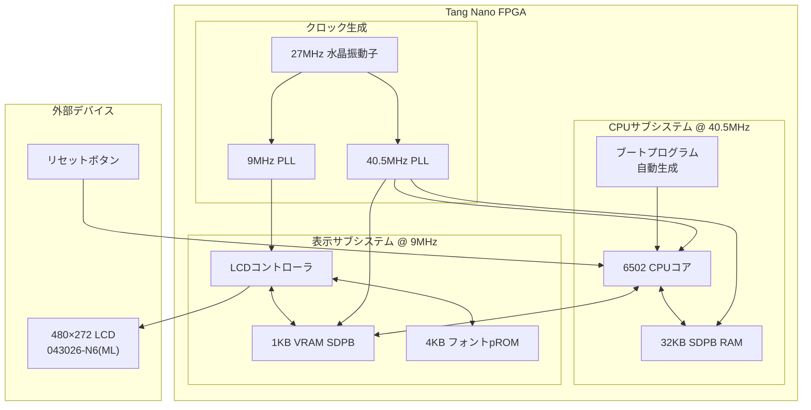
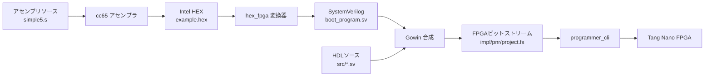
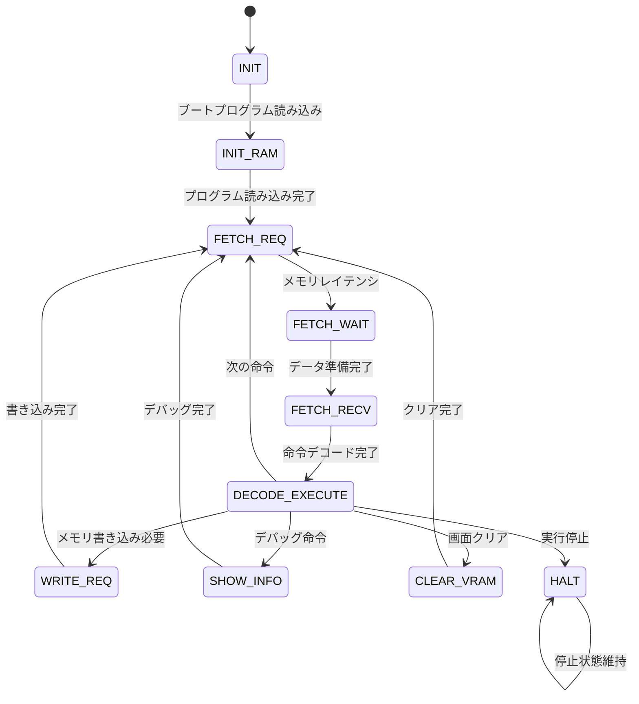
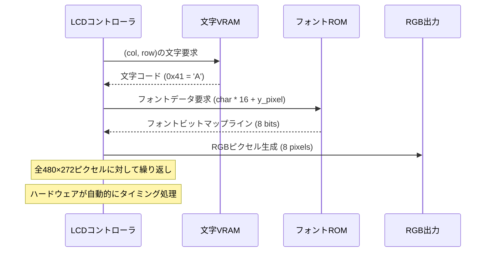

# 6502 CPU アーキテクチャ詳細ガイド

Tang Nano 9K/20K FPGA 上で SystemVerilog で実装された 6502 CPU コアの包括的な技術解説書です。初級から上級まで段階的に学習できるよう構成されています。

## 📖 学習の進め方

**初級者**: [システム概要](#システム概要)と[基本構成](#基本構成)から始める
**中級者**: [CPU 実装詳細](#cpu実装詳細)と[メモリアーキテクチャ](#メモリアーキテクチャ)を学習
**上級者**: [カスタム命令](#カスタム命令)と[最適化手法](#最適化手法)を深く理解

## 🎯 システム概要

このプロジェクトは、FPGA 上で完全なコンピュータシステムを実装した教育・学習向けプラットフォームです：

### 主要コンポーネント

-   **6502 CPU**: オリジナルの 6502 マイクロプロセッサ + カスタム拡張命令
-   **LCD 表示システム**: 480×272 ピクセル文字ベース表示
-   **メモリ階層**: RAM、VRAM、Font ROM の複合システム
-   **アセンブリ開発**: cc65 ツールチェーンによる 6502 プログラミング

### 学習目標

-   **クロックドメイン設計**: 複数クロック周波数の管理(27MHz → 9MHz/40.5MHz)
-   **ステートマシン**: 複雑な CPU 命令実行パイプライン
-   **メモリコントローラ**: SDPB RAM、VRAM、pROM インタフェース
-   **ハードウェア/ソフトウェア連携**: アセンブリプログラムと FPGA 実装の融合

## 🏗️ 基本構成

### システムブロック図



### 開発環境セットアップ

```bash
# 1. ビルド（Tang Nano 9K がデフォルト）
make                    # 基本ビルド
make BOARD=20k         # Tang Nano 20K用

# 2. FPGA書き込み
make download

# 3. アセンブリプログラム開発
cd examples
make clean && make     # simple5.s をビルド（デフォルト）
cd .. && make download # FPGAに書き込み

# 4. カスタムツールパス（必要に応じて）
make GWSH=/path/to/gw_sh PRG=/path/to/programmer_cli download
```

### ビルドフロー理解



## 🧠 メモリアーキテクチャ

### アドレス空間設計

CPU とディスプレイ両方のアクセスを最適化した洗練されたメモリ階層：

```
CPU アドレス空間 (64KB アドレッシング可能):
┌─────────────────┬─────────────────┬────────────────────────────────┐
│ 0x0000-0x00FF   │ ゼロページ      │ 高速8bitアドレッシング, 256B   │
│ 0x0100-0x01FF   │ スタック        │ ハードウェアスタック操作, 256B │
│ 0x0200-0x7BFF   │ プログラムRAM   │ メインメモリ, 30.5KB           │
│ 0x7C00-0x7FFF   │ シャドウVRAM    │ CPU読み取り用VRAM, 1KB         │
│ 0x8000-0xDFFF   │ (未マップ)      │ 将来の拡張用                   │
│ 0xE000-0xE3FF   │ テキストVRAM    │ CPU書き込み用表示, 1KB         │
│ 0xE400-0xEFFF   │ (未マップ)      │ 将来の表示拡張用               │
│ 0xF000-0xFFFF   │ フォントROM     │ CPUアクセス不可, 4KB           │
└─────────────────┴─────────────────┴────────────────────────────────┘
```

### 設計上の重要な決定

1. **デュアル VRAM アクセス**: シャドウ VRAM により CPU が表示内容を読み取り可能、一方で LCD コントローラは専用書き込みアクセス
2. **メモリマップド I/O**: VRAM は CPU には通常メモリとして見え、ハードウェアが表示タイミングを処理
3. **フォント ROM 分離**: 4KB フォントデータは LCD コントローラ専用、CPU アドレス空間を節約

### ファイル構成

```
src/
├── top.sv              # システム統合とクロック管理
├── cpu.sv              # モジュラー設計の6502 CPUコア
├── lcd.sv              # LCD タイミングと文字レンダリング
├── gowin_rpll_9K/      # Tang Nano 9K PLL設定
└── gowin_rpll_20K/     # Tang Nano 20K PLL設定

include/
├── consts.svh          # システム全体の定数とパラメータ
├── cpu_pkg.sv          # CPU固有の型と列挙型
├── cpu_tasks.sv        # 再利用可能なCPUタスクと関数
└── boot_program.sv     # アセンブリから自動生成 (examples/)
```

## ⚙️ CPU 実装詳細

### 6502 コアアーキテクチャ

保守性を重視したモジュラー設計の CPU 実装：

```systemverilog
// メインCPUモジュール構造
module cpu (
    // クロックとリセット
    input logic rst_n, clk,

    // メモリインタフェース
    input logic [7:0] dout,           // RAM読み取りデータ
    output logic [7:0] din,           // RAM書き込みデータ
    output logic [14:0] ada, adb,     // RAMアドレス
    output logic cea, ceb,            // RAM イネーブル

    // ビデオメモリインタフェース
    output logic [9:0] v_ada,         // VRAMアドレス
    output logic v_cea,               // VRAMイネーブル
    output logic [7:0] v_din,         // VRAMデータ

    // システム統合
    input logic vsync,                // WVS命令用LCDシンク
    input logic [7:0] boot_program[7680], // プログラムROM
    input logic [15:0] boot_program_length
);
```

### ステートマシン設計

CPU は多段パイプラインを使用：



### 命令実装例

**即値ロード (LDA #$41):**

```systemverilog
8'hA9: begin  // LDA immediate
    ra = operands[7:0];              // アキュムレータに値をロード
    flg_z = (ra == 8'h00);           // ゼロフラグ更新
    flg_n = ra[7];                   // ネガティブフラグ更新
    fetch_opcode(2);                 // 次の命令へ (2バイト)
end
```

**絶対アドレス格納 (STA $E000):**

```systemverilog
8'h8D: begin  // STA absolute
    automatic logic [15:0] addr = operands[15:0] & 16'hFFFF;
    sta_write(addr, ra);  // RAM vs VRAM ルーティング処理
    cea = 1;              // RAM書き込みイネーブル
    v_cea = write_to_vram; // 表示対象の場合はVRAMイネーブル
    fetch_opcode(3);      // 次の命令へ (3バイト)
end
```

## 🎨 表示システム

### LCD コントローラアーキテクチャ

LCD コントローラは CPU から独立して動作し、文字ベースのテキスト表示を実装：

```systemverilog
// 主要パラメータ
localparam int CHAR_WIDTH = 8;    // 文字あたりピクセル数
localparam int CHAR_HEIGHT = 16;  // 文字あたりピクセル数
localparam int COLUMNS = 60;      // 1行あたり文字数 (480/8)
localparam int ROWS = 17;         // 文字行数 (272/16)
```

### 文字レンダリングパイプライン



### 表示タイミング

LCD コントローラは 480×272 表示のための精密なタイミングを生成：

```
水平タイミング (9MHz ピクセルクロック):
├─ バックポーチ: 43 ピクセル
├─ アクティブエリア: 480 ピクセル
├─ フロントポーチ: 8 ピクセル
└─ 合計: 531 ピクセル/ライン

垂直タイミング:
├─ バックポーチ: 12 ライン
├─ アクティブエリア: 272 ライン
├─ フロントポーチ: 8 ライン
└─ 合計: 292 ライン/フレーム

フレームレート: 9MHz ÷ (531 × 292) ≈ 58 FPS
```

## 🔧 カスタム命令

### 拡張命令セット

標準 6502 を超えて実装された 4 つのカスタム命令：

**CVR (0xCF) - VRAM クリア:**

```systemverilog
8'hCF: begin  // CVR - Clear VRAM
    if (clear_vram_addr <= COLUMNS * ROWS) begin
        v_ada <= clear_vram_addr;
        v_din <= 8'h20;  // スペース文字
        v_cea <= 1;      // VRAM書き込みイネーブル
        clear_vram_addr <= clear_vram_addr + 1;
    end else begin
        v_cea <= 0;
        fetch_opcode(1);
    end
end
```

**WVS (0xFF) - VSync 待機:**

```systemverilog
8'hFF: begin  // WVS - Wait for VSync
    if (vsync_stage == operands[7:0]) begin
        fetch_opcode(2);  // 待機完了
    end else if (vsync_sync && !vsync_meta) begin
        vsync_stage <= vsync_stage + 1;  // VSync パルスカウント
    end
    // クロックドメイン間でVSync信号を同期
    {vsync_sync, vsync_meta} <= {vsync_meta, vsync};
end
```

**IFO (0xDF) - デバッグ情報:**

```systemverilog
8'hDF: begin  // IFO - Info/Debug
    // レジスタとメモリ内容の表示
    $display("PC=%04X A=%02X X=%02X Y=%02X SP=%02X", pc, ra, rx, ry, sp);
    $display("FLAGS: C=%b Z=%b V=%b N=%b", flg_c, flg_z, flg_v, flg_n);
    // 指定されたメモリ範囲の表示
    display_memory_range(operands[15:0]);
    fetch_opcode(2);
end
```

**HLT (0xEF) - CPU 停止:**

```systemverilog
8'hEF: begin  // HLT - Halt CPU
    // CPUを停止状態に移行（LCDコントローラは継続動作）
    state <= HALT;
    // デバッグ用停止メッセージ
    $display("CPU HALTED at PC=%04X", pc);
end
```

### クロックドメイン間設計

システムはクロックドメイン交差を慎重に管理：

```systemverilog
// VSync同期 (LCD 9MHz → CPU 40.5MHz)
logic vsync_meta, vsync_sync;
always_ff @(posedge clk) begin
    {vsync_sync, vsync_meta} <= {vsync_meta, vsync};
end

// WVS命令でのCPU使用例
if (vsync_sync && !vsync_meta) begin
    // 立ち上がりエッジ検出 - VSyncパルスをカウント
    vsync_stage <= vsync_stage + 1;
end
```

## 🧪 テストとシミュレーション

### テスト環境構築

**DSIM Studio (推奨):**

```bash
# Linux/Windows x64 のみ (macOS 未対応)
# 1. VSCode にDSIM Studio プラグインをインストール
# 2. ライセンス登録・有効化
# 3. プロジェクトファイル開く: lcd_cpu_bsram.dpf
# 4. "library configuration" 実行
# 5. テストベンチ実行: tb_cpu
```

### 利用可能なテストスイート

**tb_cpu.sv** - 完全 CPU 統合テスト:

-   基本命令実行
-   メモリアクセスパターン
-   カスタム命令検証
-   フラグ操作確認
-   スタック操作
-   分岐・ジャンプロジック
-   割り込み処理 (プレースホルダ)
-   複雑なプログラム実行
-   エラー条件処理

**tb_cpu_modules.sv** - ユニットテスト:

-   個別 CPU モジュールテスト
-   ALU 動作検証
-   メモリコントローラ検証
-   デコーダロジックテスト
-   レジスタファイル操作

**tb_lcd.sv** - 表示システムテスト:

-   LCD タイミング検証
-   文字レンダリング確認
-   VRAM アクセスパターン
-   フォント ROM インタフェーステスト

### カスタムテスト作成

```systemverilog
// テスト構造例
module tb_custom;
    // DUT インスタンス化
    cpu dut (
        .rst_n(rst_n),
        .clk(clk),
        // ... 全信号接続
    );

    initial begin
        // テスト初期化
        reset_system();
        load_test_program();

        // テストシーケンス実行
        run_cpu_cycles(100);

        // 結果検証
        assert(dut.ra == expected_accumulator)
            else $error("アキュムレータの不一致");

        $display("テスト完了");
        $finish;
    end
endmodule
```

## 💡 開発のコツ

### デバッグ戦略

**1. 波形解析:**

```systemverilog
// 信号キャプチャのためのテストベンチ追加
initial begin
    $dumpfile("simulation.vcd");
    $dumpvars(0, tb_cpu);
end
```

**2. カスタムデバッグ命令:**

```systemverilog
8'hDF: begin  // IFO - 情報/デバッグ
    $display("PC=%04X A=%02X X=%02X Y=%02X SP=%02X",
             pc, ra, rx, ry, sp);
    $display("フラグ: C=%b Z=%b V=%b N=%b",
             flg_c, flg_z, flg_v, flg_n);
    fetch_opcode(2);
end
```

**3. メモリ監視:**

```systemverilog
// 特定メモリアクセスの監視
always @(posedge clk) begin
    if (cea && ada == 16'hE000) begin
        $display("VRAM書き込み: %02X 時刻 %t", din, $time);
    end
end
```

### 性能最適化

**1. クロックドメイン最適化:**

-   ドメイン間信号を最小化
-   適切な同期器を使用
-   クロックイネーブル戦略を考慮

**2. メモリアクセスパターン:**

-   SDPB タイミング要求を理解
-   可能な場合はバーストアクセスを最適化
-   デュアルポート使用パターンを考慮

**3. ロジック使用率:**

-   合成レポートで LUT と FF 使用量を監視
-   パイプライン vs. 組み合わせ回路のトレードオフを考慮
-   クリティカルパスタイミングを最適化

### よくある落とし穴

**1. リセット極性:**

```systemverilog
// Tang Nano 9K vs 20K の違い
// 9K:  wire rst_n = ResetButton;
// 20K: wire rst_n = !ResetButton;
```

**2. クロックドメインクロッシング:**

```systemverilog
// 間違い: ドメイン間での直接割り当て
// cpu_signal <= lcd_signal;  // タイミング違反!

// 正しい: 適切な同期
always_ff @(posedge cpu_clk) begin
    {sync_reg, meta_reg} <= {meta_reg, lcd_signal};
end
```

**3. メモリ初期化:**

```systemverilog
// 適切なブートシーケンスの確保
initial begin
    // リセット解除前にプログラムをロード
    wait(boot_program_loaded);
    rst_n <= 1'b1;
end
```

## 📚 発展学習

### 高度なトピック

1. **FPGA 固有の最適化**

    - Gowin プリミティブ使用
    - ブロック RAM 設定
    - DSP スライス活用

2. **CPU アーキテクチャ拡張**

    - 新しい命令セット追加
    - 割り込み実装
    - キャッシュ設計考慮

3. **表示システム拡張**
    - スプライトレンダリング
    - ハードウェアスクロール
    - カラーパレット管理

### 推奨参考資料

-   **6502 ドキュメント**: オリジナル MOS Technology マニュアル
-   **FPGA 設計**: "Digital Design and Computer Architecture" Harris & Harris 著
-   **SystemVerilog**: "SystemVerilog for Design" Sutherland, Davidmann & Flake 著
-   **Tang Nano ドキュメント**: Gowin FPGA ユーザーガイドとアプリケーションノート

### コミュニティとサポート

-   **プロジェクトリポジトリ**: 問題と議論
-   **Tang Nano コミュニティ**: ハードウェア固有の質問
-   **6502 フォーラム**: ヴィンテージコンピューティングとエミュレーション
-   **FPGA コミュニティ**: 一般的な FPGA 設計議論

---

このガイドは Tang Nano 6502 CPU プロジェクトを理解し拡張するための基盤を提供します。基礎から始めて、コードベースと FPGA 開発ワークフローに慣れるにつれて、より複雑なトピックに段階的に取り組んでください。
