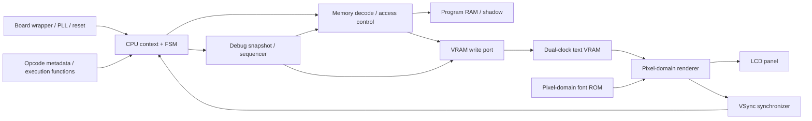

# 教材・完成版CPUのレビューと改善計画

作成日: 2026-10-02
対象: Day 01–18 の starter／completed、共通教材、Day 99 完成版、ビルド・生成ツール
基準コミット: `b261ad5` (`update: docs`)

## 1. 判断とレビュー範囲

**最初に改善するのは、学習課題と検証経路の対応、およびシミュレーションと実機の整合性である。**
現在の構成は、部品から CPU へ進む学習順、早期の LCD 可視化、Day 99 の 2-process FSM という土台を持つ。一方、完成コードがその日の課題を満たすか、テストの PASS が何を保証するか、6502 のどこまで互換かが不明瞭になっている。ここを直してから保守性を改善する。

今回確認した範囲:

- ルート README、Day 01–18 の日本語 README・CPU 機能の段階差分・starter と completed の差分。
- 各 Day の Makefile、テストベンチの接続・判定、ボード wrapper、RAM・boot loader・LCD 統合経路。
- Day 99 の現行 CPU、2,071 行の次状態計算 package、メモリ・LCD・クロック／リセット、テスト、Gowin プロジェクト。
- Day 99 の命令表・構成図・ビルド説明、アセンブリ／HEX 生成経路、同梱 Gowin primitive model。

計画作成時点では静的レビューのみで、シミュレーション・合成・配置配線・書き込みは未実施だった。以下の「確認済み」はソース上の矛盾・制御経路を確認したという意味で、実行再現を意味しない。実装後の検証結果は[最終状況](REVIEW_FINAL_STATUS_ja.md)に記録する。既存の`docs/FSM.md`にある実機成功記録も、今回の検証結果には含めない。全命令・全波形・全ボード電気仕様の完全監査は実装段階の検証対象とする。

優先度:

| 優先度 | 判断基準                                                                     |
| ------ | ---------------------------------------------------------------------------- |
| P0     | 成功判定を信用できない、完成例／実機の正しさを損なう、学習手順を成立させない |
| P1     | 命令仕様・境界条件・説明に誤りがある、拡張時に不具合を生みやすい             |
| P2     | 理解・保守・再利用を改善する。正しさの基盤を整えてから行う                   |

## 2. 確認した問題と修正方針

### R01 / P0: テスト経路がstarterとcompletedで異なる

根拠: [Day 08 starter Makefile](../day08/Makefile)、[completed Makefile](../day08_completed/Makefile)、[TFTテスト](../day08_completed/lcd/tb_tft.sv)、[ルートMakefile](../Makefile)。Day 05–18 の starter には`sim-cpu-build`があり、`sim`で CPU テストも実行する。completed の標準`sim`は TFT smoke test で、対応する`sim/tb_cpu.sv`もない。

LCD デモ内にも CPU は存在するが、TFT テストの合格条件は DEN と色の観測であり、命令結果の検証ではない。ルート`make test`は completed を回すため、starter で案内される CPU 課題の検証と一致しない。Day 01 completed には`sim`ターゲットがなく、ルートの一律実行にも不整合がある。

計画:

- `test-cpu`、`test-lcd`、`test-system`を明確に分け、`test`は各 Day で必要な検証を集約する。
- starter と completed で同じ課題仕様・同じテストを使い、completed を解答として検証する。
- CPU ソース・トップ・board define を明示する。Day 05–18 completed のシミュレーションで固定されている`top_9k.sv`を BOARD 選択へ合わせる。
- Day 01 は短いカウンタ検証を追加するか、実機課題専用であることを manifest に明記し、集約側で明示的に扱う。

完了条件: 各課題の正しい completed が通り、課題に関係する故意の誤りで対応テストが失敗する。CPU 検証結果と LCD 検証結果を別々に報告できる。

### R02 / P0: 失敗してもプロセスが成功終了する経路

根拠: [Day 15 CPUテスト](../day15/sim/tb_cpu.sv)、Day 05–18 の CPU テスト群、[Day 99 CPUテスト](../day99_completed/src/tb_cpu.sv)、[モジュールテスト](../day99_completed/src/tb_cpu_modules.sv)、ルート Makefile。

CPU テストは`error_count`を表示してから`$finish`する。Day 99 には未実装の状態チェック、検査せず待つだけのケース、VRAM 書き込み未検出を成功扱いするケースがある。Day 02–03 の Makefile は`assert`を使うテストに`--assert`を指定していない。ルートの shell loop も途中の子 make 失敗を保持せず、後続成功によって失敗を隠す可能性がある。

計画:

- 不一致・timeout を`$fatal(1, ...)`へ統一し、assertion を有効にする。
- 成功時は実行ケース数・検査数を報告する。未実装チェックを PASS として数えない。
- 集約 make は失敗時停止、または失敗一覧を蓄積して最後に非ゼロ終了する。
- テスト未実行・ツール不足・課題未実装・判定不一致を別の結果として表示する。

完了条件: DUT の演算／分岐／メモリ書き込みをそれぞれ故意に壊したとき、per-day とルートの両方が非ゼロ終了する。

### R03 / P0: メモリモデルが実機のタイミング・OCE動作と異なる

根拠: [Day 10 RAM](../day10_completed/ram.sv)、[Day 99 RAM](../day99_completed/src/ram.sv)、[top_core](../day99_completed/src/top_core.sv)、[Gowin RAM wrapper](../day99_completed/src/gowin_sdpb/gowin_sdpb.v)、[同梱primitive model](../day99_completed/deps/gw1n/prim_sim.v)。

- Day 10–18 の Verilator RAM は非同期読み出し。実機 BSRAM の読み出しはクロックに従う。単純な配列モデルではアドレス更新とデータ取得のずれを見逃す。
- Day 99 の Verilator モデルは`ceb && oce`／`v_ceb && v_oce`でのみ読み出すが、top は`oce`／`v_oce`をリセット時に 0 とし、その後 1 へ更新しない。
- 実機 IP は`READ_MODE=0`。同梱 SDPB model では bypass 出力`bp_reg`の更新は CEB に従い、OCE は追加 pipeline register を制御する。Verilator モデルと意味が一致していない。

計画: 実機の CEB・OCE・READ_MODE・読み出しレイテンシ・同一アドレスへの読み書きの動作を契約として書き、behavioral model と vendor model の両方で同じ入出力系列を確認する。Day 10 への移行で同期 RAM の待ち状態を導入し、Day 18 のフル速度でも成立させる。

完了条件: プログラムのコピーから命令実行まで両モデルで一致し、RAM の read enable を壊すと CPU テストが失敗する。実機受入は別途記録する。

### R04 / P0: Day 99のRTSが古い上位バイトを使う

根拠: [calc_decode_control_flow_next](../day99_completed/src/cpu/cpu_fsm_next_pkg.sv)、`8'h60`、`fetched_data_bytes == 2`付近。

`next.fetched_data[15:8] = cur.dout_r`の直後に、復帰アドレスを`cur.fetched_data + 1`で計算している。現在読み出した上位バイトは`cur`へまだ反映されていないため、復帰先が過去の状態に依存する。

計画: 読み出した上位バイトと保持済み下位バイトから 16bit 値を組み立ててから+1 する。先に、失敗を示す CPU 実行テストを用意する。

完了条件: `$0200`付近の呼出し、異なるページのサブルーチン、下位バイト`$FF`での桁上がり、入れ子、SP の wrap を確認する。期待する PC・SP・スタック内容を同時に検査する。

### R05 / P0: 命令表の「実装済み」が現行CPUと一致しない

根拠: [命令表](../day99_completed/docs/INSTRUCTIONS.md)、現行`calc_decode_*`群。BCS (`$B0`)・PLP (`$28`)は fetch 分類にあるが実行 handler にない。CMP／CPX／CPY は immediate のみで、表のメモリ形式まで実装した状態ではない。CLD／SED も実行 handler にない。未処理命令は次状態を変えず DECODE_EXECUTE に残る。

計画:

- 256 opcode について「命令長・addressing・変更する flags・実行 handler・対象 Day・検証状況」を棚卸しする。
- 未対応 opcode には明示的な fault／停止理由を設け、意図的な HLT と区別する。
- 直近は BCS・PLP・比較命令の不足を修正し、CLD／SED と decimal ADC／SBC は互換性方針に沿って段階追加する。
- 実装メタデータから一覧を生成しても、期待値は独立した仕様・一次資料から作る。

完了条件: 表で実装済みとした opcode 全件が CPU 実行テストを持つ。未対応 opcode・長さ不明 opcode が無言の停止や誤 fetch に進まない。

### R06 / P1: boot容量・長さ判定が不整合

根拠: [cpu.sv](../day99_completed/src/cpu.sv)、[INIT_RAM](../day99_completed/src/cpu/cpu_fsm_next_pkg.sv)、[HEX変換ツール](../day99_completed/utils/hex_fpga/main.go)、[linker設定](../day99_completed/examples/baremetal.cfg)。

boot 配列は`logic [7:0] boot_program[7680]`で 7.5KiB。コメントの最大 30KB とは異なる。生成側の length はバイト数だが、loader は index が length と等しくなるまで書き込みを行うため、`0..length`の 1 バイト余分なアクセスを生む。length=7680 では配列範囲外へ達する。`cpu.sv`は状態に関係なく配列を index する。

計画: `BOOT_CAPACITY`と length の意味を統一し、`index < length`のときだけデータ参照／書き込みする。空プログラム・容量超過の動作を定義し、CPU 解放前に最終書き込みが完了する順序を保証する。

完了条件: 長さ 0・1・容量−1・容量・容量+1 を検証し、合法な入力では指定したバイトだけが書かれ、超過入力は生成時点で拒否される。

### R07 / P1: VRAM境界・shadow・書き込みパルスの契約が曖昧

根拠: `apply_store_write`、`apply_ram_write`、`CLEAR_VRAM2`、`store_and_fetch`と fetch 遷移。

- 物理 VRAM は 1,024B、表示は 60×17=1,020 文字。通常 store の VRAM 判定は 1,020B で、文書の 1KiB 領域とは異なる。
- clear の条件は`<= 1020`で、次の VRAM アドレスと shadow アドレスに異なる index を使う。表示末尾の余分な書き込み・位置のずれを生む。
- shadow を read-only と説明する一方、通常 RAM への store 経路では直接書き込みを拒否しない。STX／STY／RMW の RAM 専用経路と STA の VRAM 経路も異なる。
- `store_and_fetch`で立てた write enable を FETCH_REQ では落とさず、FETCH_RECV で落とすため、単一の store が複数クロックの書き込みとなる。RAM では同じ値の再書き込みが見えにくいが、将来の MMIO では意味が変わる。

計画: 物理容量と表示領域を別定数にする。write 要求を一か所で decode し、命令種別による領域差をなくす。shadow の所有者・read/write 権限を決め、clear と通常書き込みで同じ index の値を保つ。書き込みを 1 要求 1 回へ統一する。

完了条件: `$DFFF/$E000/$E3FB/$E3FC/$E3FF/$E400`、shadow 両端、STA／STX／STY／RMW／clear の結果・書き込み回数を検査する。clear 後に全表示セルと shadow が一致する。

### R08 / P1: 16bitアドレスと32KiBへの折返しを区別していない

根拠: `RAMW16=16'h7FFF`、`request_data_fetch`、`return_to_opcode_fetch`、branch 計算、[Day 17の例](../day17/README_ja.md)。

アドレスの下位 15bit 化に加え、PC 加算や branch も`$7FFF`で mask する。CPU の 16bit 演算とボードの物理メモリ配置が混ざっている。Day 17 の例は`$8021`を読むが、説明される RAM 領域は`$0000–$7FFF`で、上位領域の意味を示していない。

計画: PC／実効アドレス計算は 16bit で定義し、物理変換はメモリ decode で行う。直近の教材例を実際に用意した RAM 領域へ揃える。上位 RAM mirror を残す場合は正式な platform 仕様として明記し、暗黙の mask へ任せない。

完了条件: `$00FF`のゼロページ wrap、`$7FFF`と`$FFFF`付近の PC・分岐、unmapped 領域を検査する。フル 64KiB 実装はボード資源を測って別途判断する。

### R09 / P1: LCDのCDCとpipelineをsmoke testで確認できない

根拠: Day 99 `top_core.sv`の 10bit VRAM アドレス 2 段 FF、MEMORY_CLK 側 font ROM、PixelClk 側`lcd.sv`、[PLL stub](../day99_completed/sim/gowin_rpll9_stub.sv)、[font stub](../day99_completed/sim/gowin_prom_font_stub.sv)。

複数ビットのアドレスを各 bit の 2 段 FF で渡すだけでは、値全体の整合性は保証できない。font アドレス／データもクロック境界を通る。stub は両 PLL 出力を XTAL_IN に直結し、実機の 9MHz と 40.5MHz・位相差を再現しない。font stub は全 0 で、文字の正しさを検証できない。PLL lock を使った各 domain の reset 解放もない。

計画: VRAM 読み出しと font ROM を PixelClk domain に揃え、CPU 側からは dual-clock memory の書き込み port を使う構成を第一候補とする。選択した Gowin IP の設定・衝突時動作・読み出し遅延を確認する。別案の要求／応答 handshake は、pixel deadline と複雑さを比較して採否を決める。

完了条件: 実周波数比・複数位相の simulation で文字境界／行境界／最後のセルを画像期待値と比較する。合成・タイミング・CDC 評価と 9K／20K 実機の reset／連続表示を別に確認する。simulation で metastability 耐性を証明したとは扱わない。一般的な CDC 評価軸は[AMD Report CDC](https://docs.amd.com/r/2024.2-English/ug949-vivado-design-methodology/Report-CDC)を参考にし、Gowin 固有設定は Gowin 資料で確認する。

### R10 / P1: Day 18の表示処理がCPUのRAMアクセスと競合する

根拠: [Day 18 lcd_demo](../day18_completed/lcd_demo.sv)、`ram_addr_final`、`S_WRITE_MEM_LOOP`、`pc_enable=1`。

表示 FSM がメモリを読む間、RAM アドレスを debug_addr へ切り替えるが、CPU は停止せず、CPU 由来の write enable と write data もそのまま使う。命令 fetch が debug 対象のデータを読む、CPU 書き込みが debug アドレスへ向かう経路がある。`cpu_vram_clear`は CPU へ接続されるが、表示 FSM の clear 開始条件には使われていない。

計画: IFO 開始時にレジスタを snapshot し、RAM port を debugger へ貸す間は CPU を安全な境界で止める。CPU の write を完了させてから所有権を切り替え、表示完了で戻す。CVR の外部要求と完了も接続する。

完了条件: IFO 中の CPU PC・RAM・レジスタが変化せず、復帰後も同じプログラムが継続する。CVR が全セルを消し、表示処理中の store が別アドレスへ書かれない。

### R11 / P1: 演習・解答・テストの内容がずれている

根拠例:

| 対象      | 確認したずれ                                                                                 | 修正                                                     |
| --------- | -------------------------------------------------------------------------------------------- | -------------------------------------------------------- |
| Day 05    | `cpu_registers.sv`の実装課題に対しcompletedはPCだけのCPU。対応するレジスタ解答ファイルもない | PC課題とレジスタ課題を分け、統合先・解答・テストを揃える |
| Day 06    | フラグ計算機／デコーダ統合を説明するがcompleted CPUはLDAとA更新だけでZ/Nもない               | このDayの到達仕様を決め、コードと説明の双方を一致させる  |
| Day 06    | 表の`LDA #$A9`と機械語`A9 42`が対応しない                                                    | 同じ値で例を統一する                                     |
| Day 08    | 演算課題のCPUテストが`LDA zp`を要求する                                                      | ADC/SBC・C/V/Z/Nのテストへ置換する                       |
| Day 13–14 | BIT／shiftの説明に対し、テストはJMP／branch中心。Day 13動作確認もJMPの説明                   | 当日追加機能とflag保持を検査する                         |
| Day 15    | 比較・INC/DECの課題だがテストはLDA/STA/ADC                                                   | CMP/CPX/CPY、INC/DECの境界値を追加する                   |
| Day 16–17 | indexed／indirect課題のテストがPHA/PLA／JSR/RTS                                              | 実効アドレス計算とwrapを検査する                         |
| Day 17–18 | JSRの上位バイトが`$80`、テストプログラム配置と期待PCは`$02xx`                                | 配置・機械語・コメント・期待値を一致させる               |
| Day 18    | READMEはWVS/CVR/IFO=`$12/$22/$32`、実装は`$FF/$CF/$DF`                                       | 実装とassembler表記に合わせる                            |
| Day 18→99 | IFOは1byte通知→3byte命令、WVSはcount待ち→count+1待ちへ変化                                   | 移行表を作り、仕様差を説明するか共通化する               |

WVS は Day 99 文書内でも`FF 05`を 6 回、`FF 3A`を 58 回と説明している。現行コードは count+1 なので`$3A`は 59 回。0・1・58・255 を対象に仕様を固定する。

完了条件: 各 Day の「学習目標→編集ファイル→完成例→検査→期待出力」が一対一に辿れる。assembler の例とテスト用 byte 列を照合できる。

### R12 / P1: ビルド依存関係・ボード切替・生成ツール

根拠: 各 Day の`$(PROJECT).fs`、Day 99 `SRCS`と`.gprj`、`sim-ram-build`、examples Makefile、HEX 変換ツール。

- 多くの Day は BOARD にかかわらず同じ`dayXX.fs`を使う。変数だけを変えた際、成果物の再生成を確実に要求できない。
- Day 99 の FS 依存には現行 FSM/type/constants package や`.gprj`・`.cst`・PLL IP が含まれず、変更が bitstream 再生成につながらない。
- `sim-ram-build`は存在しない`src/tb_top_core.sv`を参照する。
- programmer ログに`Error:`があっても return code が 0 なら成功終了し、Finished がなくても特定の code を成功へ変換する。成功規則の根拠を確定する必要がある。
- HEX 変換は record address を配置に使わず、checksum・短い行・容量を検査しない。Scanner 失敗もログだけで続行する。出力を先に truncate するため、失敗時に以前の生成物を失う。

計画: BOARD／SIM_TOP ごとに出力先を分け、ビルド入力の manifest を Make・Gowin・simulation で揃える。生成物の依存元・ツール版・hash を記録する。HEX は対応 record type、配置、欠損、checksum、容量を検査し、不正入力では原本を保持して停止する。出力は一時ファイルから成功後に置換する。

完了条件: FSM 変更・pin 設定変更・BOARD 切替で正しい再ビルドが起こる。壊れた HEX やプログラマ失敗を成功と報告しない。生成物の再生成で意図しない差分がない。

### R13 / P2: 実際の構造と構成図・保守手順が異なる

根拠: [MODULE_MAP](../day99_completed/docs/MODULE_MAP.md)、[architecture](../day99_completed/docs/README_architecture_ja.md)、[BUILD](../day99_completed/docs/BUILD.md)、Day 99 README／AGENTS、現行`cpu.sv`。

現行 CPU は`calc_cpu_next`を使い、`cpu_alu`・`cpu_decoder`・`cpu_memory`を instantiate しない。構成図はこれらを CPU 内部に接続しており、`top.sv`や`tests/`など現行にない経路も案内する。独立モジュールのテスト成功は現行 CPU の正しさを保証しない。FSM package のヘッダは未接続と説明しているが、実際には接続済み。定数は header と package に重複する。

計画: 現行経路を図と読解順の正本にする。旧モジュールは教材用参考として位置付けるか、同じ関数を使う wrapper へ整理する。legacy は利用者を確認してから縮小する。定数・opcode・生成仕様の正本を定め、format で vendor／generated／legacy を一括書換えしない。

完了条件: 新しい開発者が README から現在の top→CPU→FSM→RAM→LCD へ辿れ、命令追加時の編集・生成・検証手順を再現できる。

## 3. 6502互換性の目標

直近の表現は**「6502 命令の一部と LCD 向け独自拡張を備えた教育用 CPU」**へ修正する。標準 opcode の対応不足、decimal 未対応、固定開始 PC、32KiB 変換、命令実行周期の違いを踏まえると、「割込み以外は完全互換」という現在の表現は成立しない。

次の段階で目指すのは NMOS 6502 の公式命令についての命令結果互換。実機 6502 の bus cycle 互換や undocumented opcode は別目標にする。標準命令の演算・stack・branch 仕様は[MCS6500 Programming Manual](https://syncopate.us/books/Synertek6502ProgrammingManual.html)を根拠に固定する。NMOS と 65C02 の相違を混ぜず、JMP indirect のページ末尾動作・decimal flags などは対象機種ごとに追加照合する。

| 項目                       | 現状の扱い                          | 到達目標／計画                                               |
| -------------------------- | ----------------------------------- | ------------------------------------------------------------ |
| 公式命令                   | 文書とhandlerが不一致               | 全対応表とCPU実行試験。未対応を明示                          |
| D flag／decimal            | ADC/SBCはbinary計算、CLD/SEDなし    | decimalなしと明記し、その後対象機種の仕様で追加              |
| IRQ/NMI/BRK/RTI            | 受信interface・実装なし             | 今回の必須範囲から外し、明示的な未対応として扱う             |
| reset                      | PC=`$0200`、独自初期値              | 教材仕様を明記。reset vector対応は互換性拡張の段階で判断     |
| PC／address                | 15bit maskが混在                    | 16bit演算とplatform mappingを分離                            |
| cycle数                    | READMEの6502周期と独自FSM周期が混在 | 「原機の参考値」と「本実装の周期」を別欄にする               |
| 独自命令                   | Day 18と99で引数／待ち回数が違う    | byte列・長さ・副作用・完了条件を定義                         |
| Woz Monitor／Apple I BASIC | 最終目標として記載                  | 必要なI/O・ROM配置・命令・ライセンスを調査する独立課題にする |

Woz Monitor／BASIC の動作は CPU 命令対応だけでは完了しない。現行 top には該当する入力 I/O の統合がなく、原機 software との結合は別の受入条件が必要である。

## 4. 教材をStep by Stepとして再構成する

### 4.1 各Dayの共通形式

各 Day は次の順で短く読めるようにする。日本語版と英語版に同じ課題 ID・期待値を付ける。

1. 前日の到達状態と、今日追加する機能を 1 つの図／表で示す。
2. 今日の契約を定義する。入出力、reset 値、命令 byte 列、変更する flags、必要な clock 数。
3. 編集するファイルと TODO を列挙し、今回の課題が現在の回路のどこに入るか示す。
4. 入力を与えたときの PC・register・address・write enable を予測する。
5. 実装して、目的別コマンドで検証する。成功出力と失敗例を示す。
6. 波形を観察して予測との差を説明する。実機確認では期待する表示／ボタン動作を示す。
7. 完了チェックと次 Day への移行方法を示す。

完成コード全体を読む前に、当日増える部分の差分を示す。`dayXX`は前日完成状態に当日の TODO だけを足した状態にし、解答と無関係な周辺回路の違いを減らす。

### 4.2 Dayごとの改訂内容

| Day | 主題と改訂内容                                                                                                                                                            | 観測・境界ケース                                        |
| --- | ------------------------------------------------------------------------------------------------------------------------------------------------------------------------- | ------------------------------------------------------- |
| 01  | CLI／GUIの入口を明示し、starterにはMakefileがないことを説明。counter初期化とLED極性を基板資料で確認。bit24のtoggle周期を`2^24/27MHz ≈ 0.621秒`、一周を約1.243秒として訂正 | 短縮counterでreset・周期確認、実機で点滅                |
| 02  | 4bit演算・carry／borrow／zeroの仕様を明記。テスト側の未完成部分は別課題へ分ける                                                                                           | `0,1,7,8,15`、overflow、全入力組合せ                    |
| 03  | FSMの状態とtimerの更新を1edgeごとに予測。counter／PWM／dividerの任意課題にも検証を用意                                                                                    | timer境界、reset中断、PWM 0/255、divider 0/1/奇数の定義 |
| 04  | LCD全実装を必須にする負荷を下げ、既存表示基盤へ文字を1つ書く課題を入口にする。BSRAM／font pipeline詳細は発展へ分ける                                                      | row/column→VRAM address、先頭／末尾文字                 |
| 05  | PC enable/resetを最小課題にし、register bankを導入するなら独立テストとCPUへの接続を用意                                                                                   | enable=0、reset、PC wrap、register保持                  |
| 06  | `A9 42`のfetchを時系列で説明し、LDAのZ/Nと変更しないflagsを明記                                                                                                           | `#$00/#$7F/#$80/#$FF`、NOPとの混在                      |
| 07  | transferとincrementの違い、結果とflag更新を説明                                                                                                                           | `$FF→$00`、TXA/TYA、C/V保持                             |
| 08  | ADC/SBCでCとVの意味を分け、式を固定。decimalは別範囲と明記                                                                                                                | `$7F+1`、`$FF+1`、borrow、C=0/1                         |
| 09  | 相対分岐の基準を「次命令のPC」に統一                                                                                                                                      | taken/not taken、負offset、−128/+127、page越え          |
| 10  | ROM→同期RAM、stack、JSR/RTSの3変更を小節に分ける。早い段階でRAM latencyを解決                                                                                             | push/pullのSP順序、入れ子、enable停止中のwrite          |
| 11  | zero page store→loadを最小例にし、プログラム領域とは別にRAM初期値を管理                                                                                                   | `$00/$FF`、書き込み後読み出し、flags保持                |
| 12  | little endianと16bit operand fetchを波形で示す                                                                                                                            | `$1234`、低byte carry、異なるbyteを使う例               |
| 13  | logicとBITを分け、BITがAを変えずN/Vをメモリから得ることを確認                                                                                                             | AND/ORA/EOR、BITのZ/N/V、C保持                          |
| 14  | carry入力／出力の位置をbit図にする。accumulator形式とmemory形式の到達範囲を明記                                                                                           | `$00/$01/$80/$FF`、ROL/RORのC=0/1                       |
| 15  | compareがregisterを変えず、SBCと違い入力Cを使わないことを示す                                                                                                             | equal/less/greater、INC `$FF`、DEC `$00`、V保持         |
| 16  | address加算とデータ演算を区別し、対象領域を示す                                                                                                                           | index=0/255、page越え、STA indexed                      |
| 17  | `(zp,X)`と`(zp),Y`の読み出し順を2つの時系列で比較。メモリを準備した例を掲載                                                                                               | pointer `$FF`のwrap、X/Y差、JMP indirect境界            |
| 18  | CVR/IFO/WVSの命令仕様、外部要求／完了、RAM所有権を説明し、実際の接続まで課題にする                                                                                        | WVS待ち回数、IFO snapshot、clear全セル、timeout         |
| 99  | 18から完成版への設計変更を「統合・同期RAM・2-process FSM・debug制御」の順に案内                                                                                           | 同じ小プログラムを両CPUで実行し、仕様差を説明           |

### 4.3 教材表現と学習効果

- `<=`は「clock 周期の終わり」ではなく「edge で評価した値を simulation の NBA 更新段階で反映」と説明し、`cur`と`next`を使う RTS 例へ接続する。
- 間接アドレスの比喩を使った後は、実際の 2byte pointer と読み出し順を必ず示す。HDMI を出力しない回路の図には LCD 接続だけを描く。
- 「常に」「完全」「包括的」などは保証範囲を伴う場合だけ使う。途中の模擬データ・実 CPU・debug 表示を区別する。
- 初学者が Day 06・10・17 の 3 課題を、予測→実行→説明できるか確認する。所要時間、つまずく手順、誤答を記録し、UI の見栄えだけで学習効果を判断しない。

## 5. Day 99の設計・保守性の改善

### 5.1 採用する構成

2-process FSM を維持し、package と function を責務ごとに整理する。現行の独立モジュール群を急いで CPU へ接続する大規模置換は行わず、検証した演算関数・opcode 定義を正本にする。

これは改善後の責務図。現在の結線を示す図は別途、現行ソースに合わせて更新する。

| 責務        | 改善内容                                                            | 注意点                                                                                 |
| ----------- | ------------------------------------------------------------------- | -------------------------------------------------------------------------------------- |
| CPU状態     | architectural register、実行stage、bus出力、debug状態を型で区別     | struct変更前にCPU traceを固定する                                                      |
| opcode      | fetch長・実行handler・flagsの宣言を照合する                         | 自動生成だけを期待値の根拠にしない                                                     |
| ALU         | binary演算・compare・shiftを共通関数へまとめ、flag write maskを明示 | 独立`cpu_alu`のCMP Nは入力C依存の減算結果を使うため修正対象。例: A=`$80`, M=`$00`, C=0 |
| memory      | 16bit論理address、領域decode、書き込み回数、shadow規則をまとめる    | CPUとdebugの所有権を明示する                                                           |
| fetch/write | 要求・応答・待ち状態を固定し、enable停止中に要求を再実行しない      | 学習用CPUの`pc_enable`とRAM clockの関係も扱う                                          |
| debug       | IFO開始時のsnapshotとメモリ検査を独立させる                         | 表示中に異なる時点のregisterを混在させない                                             |
| LCD         | pixel側のRAM／font読みとDE/RGBをlatencyに合わせる                   | offsetのmagic numberを増やして合わせない                                               |
| reset       | 非同期assert・各domainで同期deassert、PLL lock待ち                  | wrapperのボタン極性コメントも実配線と照合する                                          |

現在の 2,071 行 package は boot/fetch、addressing、命令群、debug／clear へ分ける。分割は挙動を変えずに行い、R04–R08 の修正と同じ変更に混ぜない。関数の`handled`、`next`で変更する field、終了条件を明示する。

### 5.2 共通化の境界

- 共有するのはビルド規則、board 選択、テスト結果形式、安定した LCD 基盤、仕様データ。
- 各 Day の CPU と課題固有テストは教材フォルダから読める状態を保つ。抽象化のために学習者が多数の共通ファイルを追う設計は避ける。
- lesson manifest に前提 Day・編集対象・追加 opcode・テスト・実機条件を持たせ、README のリンクと課題対応を検査する。
- 共通基盤変更後は全 completed と代表 starter で回帰確認する。生成・vendor ファイルは format 対象から除く。

## 6. 検証計画

| 層         | 検査内容                                                   | 合格で言えること                             |
| ---------- | ---------------------------------------------------------- | -------------------------------------------- |
| 文書／構成 | link、課題ID、opcode byte列、source list、generated依存    | 説明と実行入口が対応する                     |
| 演算       | ADC/SBCの256×256×2入力、compareのC独立性、shift、flags保持 | 演算関数が定義した仕様に合う                 |
| CPU単体    | 小プログラム、命令完了時のPC/A/X/Y/SP/P、RAM差分           | 現行CPUの命令結果が合う                      |
| メモリ     | boot容量、CEB/OCE、同期read、衝突、write回数、shadow       | modelと実機IP契約が一致する                  |
| システム   | CPU→RAM→VRAM、IFO/CVR/WVS、LCD画素のscoreboard             | 指定model・clock条件で統合動作が合う         |
| FPGA build | 9K/20K、LUT/FF/BSRAM、timing、clock/reset/CDC              | 指定device・tool版で配置配線と制約が成立する |
| 実機       | reset連打、長時間表示、文字端、loop、WVS回数、書き込み結果 | 指定基板・LCD・条件で実動作を観測できる      |
| 学習       | 予測・実装・波形説明、つまずきの記録                       | 対象学習者が課題の目的を理解できる           |

CPU の比較は単なる固定 clock 数の待機を減らし、命令完了・HLT・fault を観測して timeout 付きで行う。独立 reference との比較は、対象 6502 variant・未対応命令・platform map を固定してから追加する。LCD model では実 font を使い、文字ごとの画素位置を確認する。

証拠には commit、BOARD、tool 版、コマンド、終了 code、対象 case、log／waveform／画像を残す。実機未実施は未実施と記録し、simulation の成功を代用しない。

## 7. 実施順と完了判定

| 段階          | 作業                                                     | 依存／完了条件                                          |
| ------------- | -------------------------------------------------------- | ------------------------------------------------------- |
| 0: 現状固定   | 課題・命令・ビルド入力一覧、既存テスト結果と失敗例の採取 | 現在の失敗を成功に変換せず記録できる                    |
| 1: 検証入口   | R01/R02/R03、sim-ram入口、BOARD別出力                    | completed CPUを実行・検査し、故意の誤りで集約testも失敗 |
| 2: 正しさ     | R04–R08、R10、HEX／boot検査、未対応fault                 | 指摘した最小再現と境界ケースが通る                      |
| 3: 教材修正   | R11、Day 01–03の基本仕様、06/10/17/18を先行改訂          | starter・completed・文書・課題testが一致                |
| 4: 表示／実機 | R09、pixel pipeline、reset/lock、clock制約               | 両model、両board build、指定実機条件を別々に確認        |
| 5: 保守整理   | R12/R13、package分割、生成／共通化、全Day日英更新        | 挙動差分なし、依存更新が再buildに反映                   |
| 6: 互換性拡張 | 公式命令不足、decimal、software移植要件                  | 仕様範囲ごとの実行証拠を得て互換性表現を更新            |

各段階を独立した変更単位にし、テスト入口修正、CPU bug 修正、挙動を保つ分割、教材更新をレビューしやすくする。初回実装は**Day 08の課題テスト整合、Day 99 RAM model整合、RTS最小再現**を代表例にして検証基盤を固める。

最終チェック:

- [ ] 各 Day の新機能が、その Day の completed と専用テストで確認できる。
- [ ] 不一致／timeout／ツール不足で誤った PASS を出さない。
- [ ] 同期 RAM・OCE・boot・write 回数・shadow の契約が実装と一致する。
- [ ] RTS・branch・stack・index・独自命令の境界を検査する。
- [ ] 実装済み命令表が実行 handler と一致し、未対応を明示する。
- [ ] Day 18→99 の引数・待ち回数・FSM・メモリ方式の変化を説明する。
- [ ] 構成図・build 手順・ファイル経路・生成仕様が現行に合う。
- [ ] 9K／20K の build、simulation、実機結果を混同しない。
- [ ] 学習者が値を予測し、波形を使って理由を説明できる。

## 8. 保留して判断する事項

- 全 64KiB RAM、IRQ/NMI、原機 bus cycle 互換、Woz Monitor／BASIC 移植は必須修正に混ぜない。要求 software・resource・timing から追加範囲を決める。
- LCD の CDC 改修案は Gowin の対象 IP・実測 latency・resource 利用で選ぶ。現行の 2 段 FF を増やすだけの対応では完了としない。
- legacy 削除、CPU 全 Day の共通化、教材全体の interactive 化は、利用者と学習負荷を確認して判断する。
- FPGA／LCD のボタン極性、電気特性、panel timing は原資料と実機で照合する。今回の静的レビューだけで正常性を断定しない。

## 9. モデル別の担当案

追加日: 2026-10-02

**GLM-5.3-Flashは仕様が固定された修正、GLM-5.3は局所的なコード・テスト実装、GPT-6.1 Solは複数の状態・クロック・所有権をまたぐ設計と独立レビューへ割り当てる。**

これは本リポジトリの作業内容に基づく暫定的な担当判断である。3 モデルで同じ SystemVerilog 課題を比較実行していないため、「GLM では不可能」「Sol なら正しい」とは断定しない。優先度 P0 であることと、強いモデルを必要とすることは別である。

公式資料は[GLM-5.3](https://docs.z.ai/guides/llm/glm-5.3)、[GLM-5.3-Flash](https://docs.z.ai/guides/vlm/glm-5.3-flash)、[GPT-6.1 Sol](https://developers.openai.com/api/docs/models/gpt-6.1-sol)を確認した。各社の一般的な coding 能力の説明から、この FPGA 設計での優劣は確定できない。

### 9.1 GLM-5.3-Flashを第一候補にする作業

| 対象    | 任せる範囲                                                                        | 前提／確認                                               |
| ------- | --------------------------------------------------------------------------------- | -------------------------------------------------------- |
| R02     | `$fatal`、`--assert`、timeout、集約makeの終了code修正                             | 検査条件を緩めず、故意の失敗が非ゼロ終了することを確認   |
| R11     | opcode番号・byte列・コメント・表・計算値の訂正、重複文の整理                      | 正しい値と対象ファイルを指示し、命令仕様の変更を含めない |
| R12     | 存在しないpathの修正、依存ファイル追加、BOARD別出力、generated/vendorのformat除外 | 元のbuild動作を把握し、両BOARDの依存関係を確認           |
| R13     | 現行path、構成図、読み順、古いヘッダの更新                                        | 現行接続図を根拠として渡す                               |
| 教材4章 | 確定した課題templateへの整形、日英の課題ID・期待値の同期                          | flag・cycle・addressの意味を独自に補完しない             |
| 棚卸し  | opcode・source・リンク・TODO一覧の生成                                            | 一覧の生成と仕様の判断を区別する                         |

Flash には 1 項目または 1Day ずつ渡し、対象・期待値・禁止する仕様変更・完了条件を固定する。R02 でも未実装の CPU 検査を新たに設計する部分は GLM-5.3 以上へ分ける。

### 9.2 GLM-5.3を第一候補にする作業

| 対象        | 任せる範囲                                                             | Solへ回す境界                                                 |
| ----------- | ---------------------------------------------------------------------- | ------------------------------------------------------------- |
| R01         | 目的別test target、starter/completed共通検査、Day 01–03の小規模test    | 共通memory protocolやCPU全体の検証interfaceを新設するとき     |
| R04         | 指摘済みRTSの値組立て修正、局所的な回帰test                            | fetch timingやstack全体まで変更が広がるとき                   |
| R05の一部   | BCS、binary比較、明確なflag更新など仕様が固定された命令の追加          | PLPのstatus方針、fault設計、decimal、複数段addressingの共通化 |
| R06の一部   | 容量定数・guard・コメント・生成時上限、境界case                        | 最終書き込みとCPU解放の時系列設計はSolで確認                  |
| R11         | Day 06–09・11–16の課題testと解答の整合、期待値付き教材改訂             | 同期RAM／indirect／外部完了待ちまで設計し直すとき             |
| R12         | HEX parserの検証、checksum、address配置、atomic output、再現可能な生成 | 対応record／欠損の仕様が未確定なら先に仕様を決める            |
| 5章ALU      | binary演算関数・CMPの入力C独立性・flag保持の修正                       | decimal semanticsやCPUとの統合再設計                          |
| 5章構造整理 | 決まった境界に従うpackage分割                                          | 分割境界、state所有者、bus契約の判断はSol                     |

RTS は重大な不具合だが、原因と修正範囲が既に具体化されているため、GLM-5.3 へ任せる候補にできる。実装前に反例を作り、修正後に PC・SP・stack を確認する。コード量が少なくても CPU 状態を扱うため、初回は Sol の独立レビューを推奨する。

### 9.3 GPT-6.1 Solを設計・レビュー担当にする作業

| 対象            | 担当する範囲                                                     | 理由                                                    |
| --------------- | ---------------------------------------------------------------- | ------------------------------------------------------- |
| R03             | vendor/behavioral RAM契約、同期read、fetch待ち状態、両model比較  | OCE・CEB・read latency・CPU stateの関係を同時に判断する |
| R05の難しい部分 | 未対応fault、PLP/status、decimal、命令結果互換性の方針           | 単にopcodeを追加しても互換性は成立しない                |
| R06の時系列     | boot最後の書き込み、範囲外参照防止、CPU解放                      | `cur/next`とRAMが書き込むedgeの関係を追う必要がある     |
| R07             | writeを1回にするprotocol、VRAM/shadow一貫性、RMW統合             | enable変更がfetch・store・debug・clearへ波及する        |
| R08             | 16bit論理addressと物理decodeの分離、mirror/unmapped方針          | PC・branch・JMP・memory map・既存programの挙動が変わる  |
| R09             | LCD clock domain、dual-clock RAM、pixel pipeline、reset/PLL lock | CDCとdeadlineはsmoke testや局所修正だけで評価できない   |
| R10             | CPU/debugのRAM所有権、snapshot、停止／復帰、CVR完了              | CPUを止める境界とpending writeを含む全体設計が必要      |
| 教材の骨格      | Day 04の負荷、Day 10の同期RAM導入、Day 17–18→99の移行            | 解説だけでなく到達仕様と回路構成を決める必要がある      |
| 5章設計         | FSM分割境界、bus契約、state責務、共通化範囲                      | 大きなrefactorの前に不変条件を定義する必要がある        |
| 統合受入        | 複数Dayの回帰、model差、実機結果、互換性表現の最終レビュー       | 個々のPASSで見落とす接続・前提の不一致を確認する        |

これらも仕様・不変条件・期待 trace が固定された後は、GLM-5.3 へ実装を分担できる。Sol に集中させるのは設計判断、問題切分け、統合の確認である。どのモデルでも実機の timing・CDC・長期安定性を文章上の推論だけで保証できない。

### 9.4 進め方と担当変更の条件

1. Flash で R02 の終了判定と、R11/R13 の明確な文書訂正を進める。
2. GLM-5.3 で R01 の test 入口、R04 の RTS、R12 の HEX 検査を個別変更として実装する。
3. Sol で R03 の RAM 契約を確定し、R06/R07/R08/R10 を実際の clock edge と所有権から設計する。
4. Sol で R09 を設計し、実装範囲が固定された部分を GLM へ渡す。
5. 正しい完成例を基に GLM で全 Day の課題・テストを揃え、Flash で日英文書を同期する。Sol は段階境界をレビューする。

Sol へ担当を変える条件は、修正が別の状態遷移へ波及する、vendor model と behavioral model が食い違う、期待値が仕様として決まらない、テストを緩めないと通らない、同じ原因不明の失敗を繰り返す場合とする。実機だけの失敗では model を替える前に clock・timing・波形・接続の証拠を取得する。

初回は R02・R04・Day 08 教材 test の 3 作業について、完了条件を満たしたか、追加レビューで何件の欠陥が出たか、所要時間・利用量を記録する。その結果で担当範囲を広げる。モデル名だけで恒久的な能力境界を固定しない。
